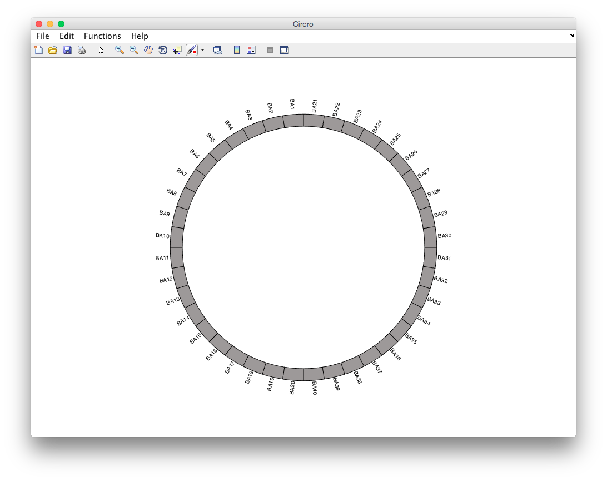
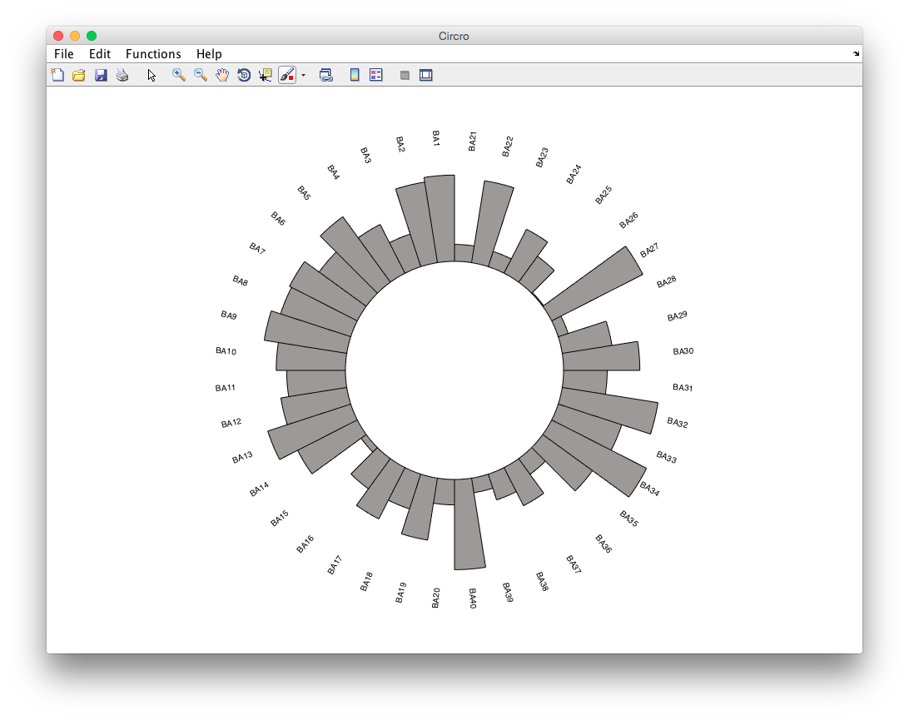
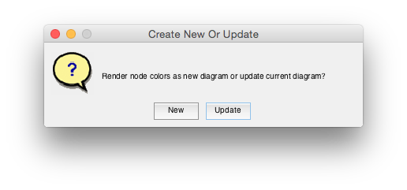
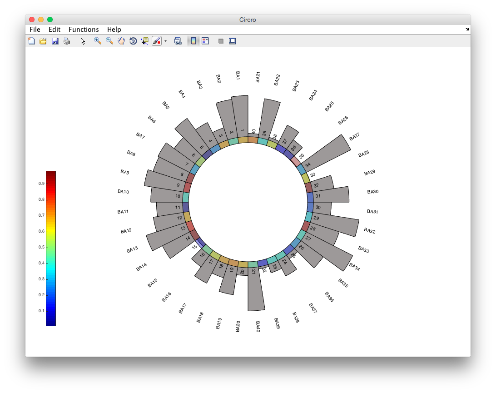
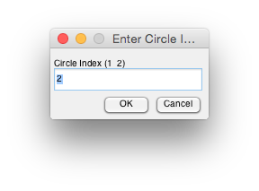
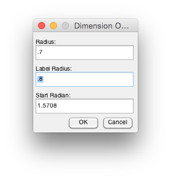
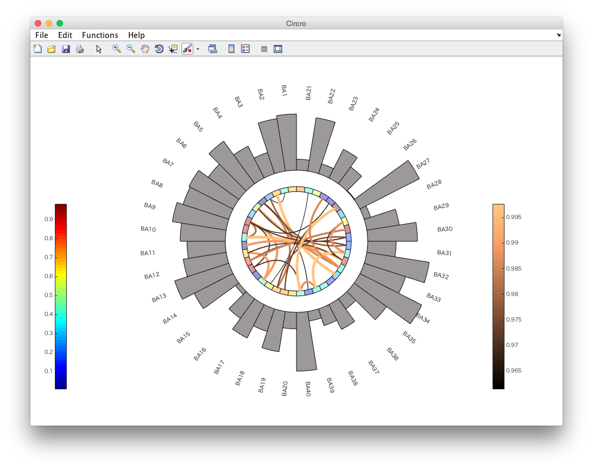
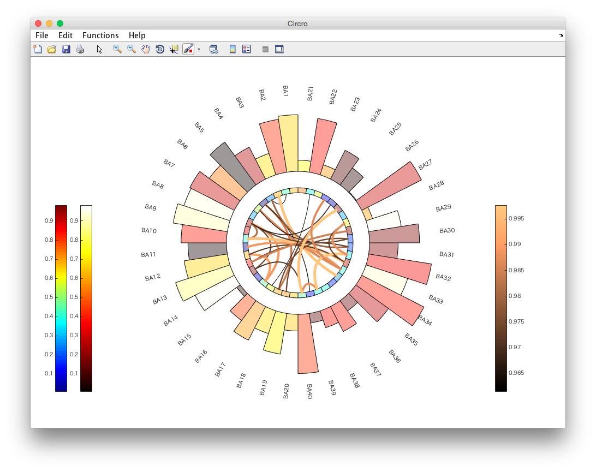
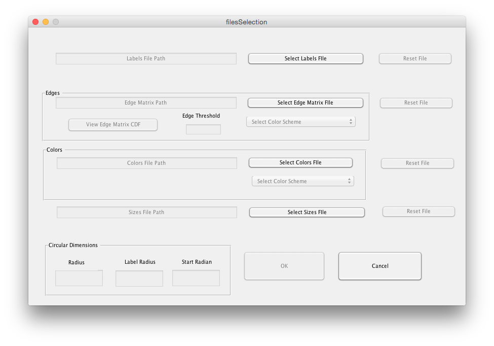
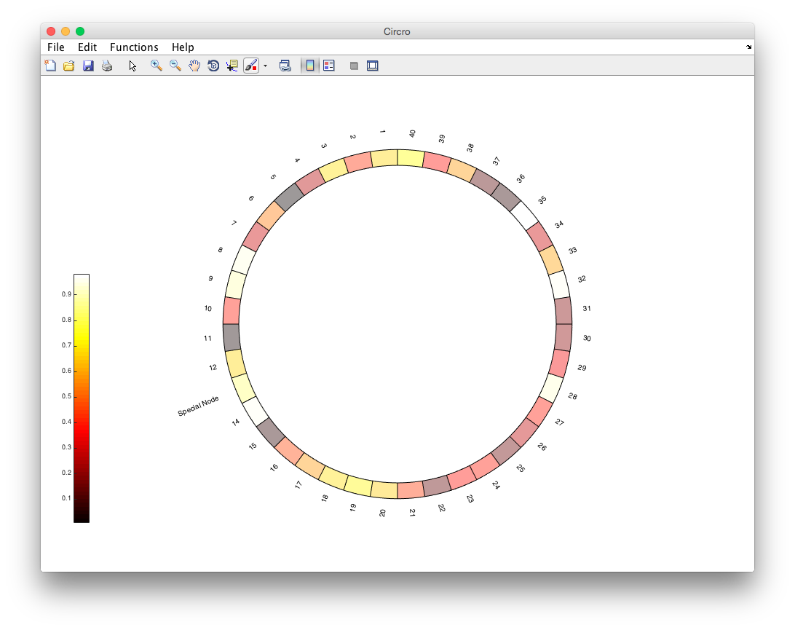

# Circro

Circro is a Matlab based application for rendering nodes and edges as circular diagrams.  
Built with a code architecture similar to [MRIcroS](http://www.nitrc.org/projects/mricros/).


##Requirements
Tested on Matlab 2014.

##Installation
 1. Download
 2. Add to Matlab Path

##How to Use
Launch GUI by typing below at Matlab command prompt:
```matlab
Circro;
```
###Render Node Labels
Functions => Circro => Set/Add Node Labels => Choose labels file (example file at data/labels.xlsx)



###Render Node Sizes
Now we shall add node sizes to diagram from above

Functions => Circro => Set/Add Node Sizes  
A pop up is shown asking if we wish to update the current diagram, or create a new one based on the sizes.  
Let's update the current diagram.  


Choose data/sizes.xlsx for the sizes



###Render Node Colors
Functions => Circro => Set/Add Node Colors

As there is a already a diagram, we are prompted if we wish to create a new diagram or update current.  
To highlight the ability to render multiple diagrams, choose "New", & then select data/colors.xlsx.



When prompted if you wish to choose a colorscheme, choose "yes" and then type "jet".



###Toggle Labels
The above colors diagram has the default labels. These can be toggled off via:  
Functions => Circro => Toggle Labels

Make sure Circle Index 2 is selected for the labels to be toggled (index 2 because it was the second diagram added)




The labels are no longer displayed


###Update Diagram Dimensions
To prevent the overlay between the two diagrams, the dimensions (radius, label radius, & start radian) of either of the diagrams can be changed.

Functions => Circro => Set Dimensions
- select index 2 for colors diagram
- select the following dimensions
 - radius .7
 - label radius .8 (toggled off so won't be displayed anyway)
 - start radian 1.5708 (pi/2, default)




###Render Edge Weights
Functions => Circro => Set/Add Edge Weights

Choose update to add to the colors diagram, index 2.  
Than select data/matrix.

A PDF of the edge weights will be displayed. A threshold of .96 is selected for this example


Select 'copper' for the edge weights color scheme.


Note the colorbars have different limits for the different data represented

###Support for Multiple Colorbars
Circro provides support for rendering 3 colorbars for nodes, and 1 colorbar for edges. Colorbars associated with nodes are rendered on the left, and colorbars associated with edges are rendered on the right.  

If your diagram requires more than 3 colorbars on the left (for nodes) or more than 1 colorbar on the right (for edges), then manual positioning of the colorbars will be necessary to prevent overlap.

To highlight the capability of representing multiple colorbars, we can add color to the diagram with sized nodes.

Functions => Circro => Set/Add Node Colors => Update Circle (index 1) => data/colors.xslx => Set Color Scheme ('hot')



We will render a third diagram with the following steps:

1. Functions => Circro => Set/Add Node Colors => New => data/colors.xlsx => Set Color Scheme => 'bone'
* Functions => Circro => Toggle Labels => Index 3 (turn off labels)
* Functions => Circro => Set Dimensions (Index 3) => radius = .85, label radius = .85 (irrelevant because toggled off), start radian = 1.5708 (pi/2, default)


###Update Edge Threshold

Functions => Circro => Set Edge Threshold (should automatically set the index to the diagram with edges) => .93


###Simultaneously Render Diagram with Many Characteristics
 File => Circro => Add Diagram



###Scripting
All GUI functionality can be scripted.

####Code Architecture
The [GUI callbacks](https://github.com/bonilhamusclab/circro/tree/master/+gui/) just obtain user input and than invoke a command in the [+commands folder](https://github.com/bonilhamusclab/circro/tree/master/+commands/).

However, the GUI callback does not invoke the command directly, instead the command name & paramaters are passed to the "Circro" command.

For example, the Set/Add Node Labels Callback invokes commands.circro.setNodeLabels via:
```
Circro('circro.setNodeLabels', labelsFile, circleIndex);
```

Invoking a command through "Circro" ensures that the command history is recorded.

####Viewing Code History

The commands corresponding to a particular GUI session can be viewed by: 
  Functions => Echo instructions to command window

The following history corresponds to the example shown above

```
%%Command History%%
Circro('circro.setNodeLabels','data/labels.xlsx',1);
Circro('circro.setNodeSizes','data/sizes.xlsx',1);
Circro('circro.setNodeColors','data/colors.xlsx',2,'jet');
Circro('circro.toggleLabels',2);
Circro('circro.setDimensions',0.7,0.8,1.5708,2);
Circro('circro.setEdgeMatrix','data/matrix.xlsx',0.96,'copper',2);
Circro('circro.setNodeColors','data/colors.xlsx',1,'hot');
Circro('circro.setNodeColors','data/colors.xlsx',3,'bone');
Circro('circro.toggleLabels',3);
Circro('circro.setDimensions',0.85,0.85,1.5708,3);
Circro('circro.setEdgeThreshold',0.92,2);
%%%%
```

On the to-do list is to create documentation for each of the commands. Until then, the inputs each command takes can be viewed by the command's associated code or by viewing the history output.

####Editing Graphics Via Code
Circro is rendered as a Matlab figure, therefore features associated with Matlab plotting are available (data point selection, image export, adding text, etc..)  
The handle to the Matlab figure can be obtained by:
```matlab
v = Circro;
```
It is possible to become familiar with v through exploring it's properties on the Matlab command prompt.
This allows for setting properties of the figure & children via code, as shown in the example below, which changes a node's label.
```matlab
v = Circro('circro.setNodeColors', 'data/colors.xlsx');
axesChild = v.Children(2); %1 is the colorbar
for i = 1:length(axesChild.Children)
  graphObj = axesChild.Children(i);
  isLabel = isprop(graphObj, 'String');

  isLabel13 = false;
  if isLabel, isLabel13 = strcmp(graphObj.String, '13'); end
  if isLabel13
    set(graphObj, 'String', 'Special Node');
    set(graphObj, 'horizontalalignment', 'right');
  end
end
```


##Data Inputs
Circro expects excel files as input.
Sample files may be found in the [data folder](https://github.com/bonilhamusclab/circro/tree/master/data)
 - Labels: 
  - 2 columns with label names 
  - left column labels rendered counter clock wise from start radian. 
  - right column labels rendered clock wise from start radian
 - Colors
  - 2 columns with numbers ranging from 0 to 1
  - color specified according to number & chosen color map
  - color map set in application, not in file
  - left column rendered counter clock wise from start radian
  - right colomn rendered clock wise from start radian
 - Sizes
  - same 2 column layout as labels & colors
  - specifies the distance from the node's outer edge to the radius
 - Matrix
  - matrix of size n x n (n is number of nodes)
  - the value corresponds to the edge strength between the nodes
  - only upper triangle of matrix is analyzed

##To Do List
1. Add Support for plain-text CSV
2. Add documentation for each of the commands

##Contributions
- [Dr. Bonilha Lab at MUSC](http://academicdepartments.musc.edu/neurosciences/neurology/research/bonilha/)
- [Special thanks to JCMosher for providing code to render a label's text at the same angle as the corresponding node](https://github.com/bonilhamusclab/circro/issues/1)
